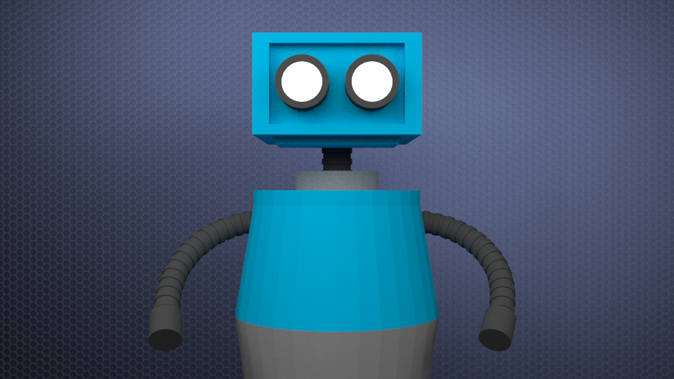

# Beginner Blender Tutorial: How to Model and Animate a Robot

This repository hosts the Blender files and assets needed to model and animate the robot in my tutorial series on [Medium](https://medium.com/@jarednielsen/beginner-blender-how-to-model-and-animate-a-robot-9be018e264a3).

## License
[gpl-3.0](http://www.gnu.org/copyleft/gpl.html)
